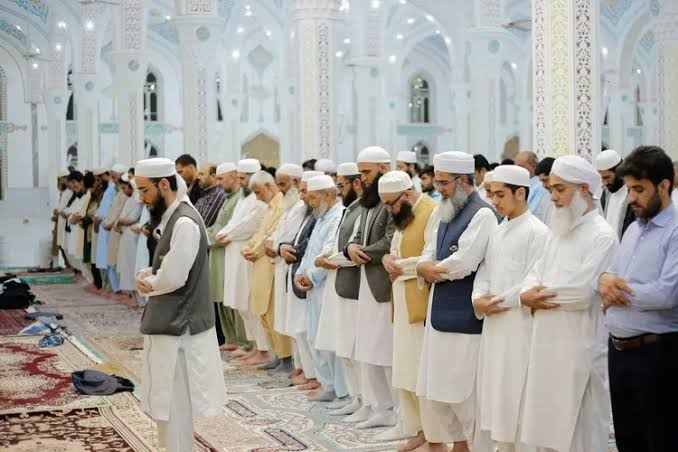
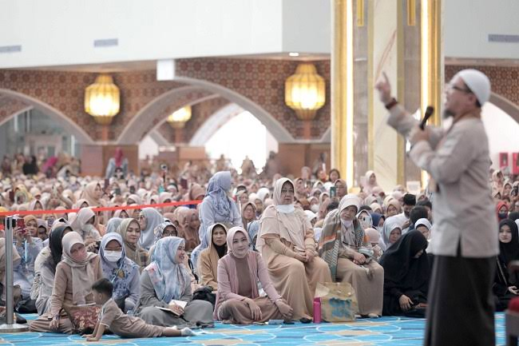

Maulid Nabi Muhammad SAW adalah peringatan hari lahir Nabi yang jatuh
pada 12 Rabiul Awal dalam kalender Hijriyah. Peringatan ini menjadi
momen untuk mengenang keteladanan Rasulullah dalam kehidupan sehari-
hari. Banyak umat Islam di berbagai belahan dunia merayakannya dengan
cara yang berbeda-beda, tergantung pada budaya dan tradisi masing-
masing.

Lalu, bagaimana cara kita menyambut Maulid Nabi dengan penuh makna dan                                                sesuai ajaran Islam? Berikut beberapa cara yang bisa dilakukan:

## 1. Meningkatkan Ketaatan kepada Allah dan Rasul-Nya

Peringatan Maulid Nabi sebaiknya tidak hanya menjadi seremoni tahunan,
tetapi juga momen untuk meningkatkan keimanan dan ketakwaan. Caranya
adalah dengan lebih sering membaca Al-Qur’an, memperbanyak shalat
sunnah, berdzikir, serta berusaha menjalankan sunnah Rasulullah dalam
kehidupan sehari-hari.

Dalam Al-Qur’an, Allah SWT berfirman:

قُلْ اِنْ كُنْتُمْ تُحِبُّوْنَ اللّٰهَ فَا تَّبِعُوْنِيْ يُحْبِبْكُمُ اللّٰهُ وَيَغْفِرْ لَـكُمْ ذُنُوْبَكُمْ ۗ وَا للّٰهُ غَفُوْرٌ رَّحِيْمٌ (٣١)

Artinya: "Katakanlah (Muhammad), "Jika kamu mencintai Allah, ikutilah
aku, niscaya Allah mencintaimu dan mengampuni dosa-dosamu." Allah Maha
Pengampun, Maha Penyayang." (QS. Ali 'Imran: 31)

Ayat ini menegaskan bahwa bukti cinta kepada Nabi adalah dengan
mengikuti ajaran dan sunnahnya.

## 2. Memperbanyak Shalawat kepada Nabi

Salah satu cara terbaik untuk menyambut Maulid Nabi adalah dengan                                                     memperbanyak membaca shalawat. Allah SWT sendiri memerintahkan umat
Islam untuk bershalawat kepada Rasulullah dalam firman-Nya:

اِنَّ اللّٰهَ وَمَلٰٓئِكَتَهٗ يُصَلُّوْنَ عَلَى النَّبِيِّ ۗ يٰۤـاَيُّهَا الَّذِيْنَ اٰمَنُوْا صَلُّوْا عَلَيْهِ وَسَلِّمُوْا تَسْلِيْمًا (٥٦)

Artinya: "Sesungguhnya Allah dan para malaikat-Nya bershalawat untuk
Nabi. Wahai orang-orang yang beriman! Bershalawatlah kamu untuk Nabi
dan ucapkanlah salam dengan penuh penghormatan kepadanya." (QS. Al-Ahzab: 56)

Membaca shalawat tidak hanya sebagai bentuk penghormatan kepada Nabi,
tetapi juga memiliki banyak keutamaan, seperti dihapuskan dosa-dosa
kecil, mendapatkan syafa'at Nabi di hari kiamat, serta mendekatkan
diri kepada Allah.

## 3. Mempelajari Sirah (Sejarah) Nabi Muhammad SAW

Peringatan Maulid Nabi menjadi waktu yang tepat untuk mengenal lebih
dalam sosok Rasulullah. Umat Islam dianjurkan untuk membaca atau
mengikuti kajian tentang sejarah hidup beliau, mulai dari kelahiran,
perjuangan dalam menyebarkan Islam, akhlak mulia, hingga kisah-kisah
inspiratif yang bisa dijadikan teladan.

Dengan mengetahui dan memahami perjalanan hidup Nabi, kita dapat meneladani sikapnya
dalam berbagai aspek kehidupan, seperti kejujuran, kesabaran, kasih
sayang, dan semangat dalam beribadah.

## 4. Mengadakan Majelis Ilmu dan Pengajian

Banyak masjid dan pesantren mengadakan majelis ilmu atau pengajian
dalam rangka menyambut Maulid Nabi. Acara ini biasanya diisi dengan
ceramah tentang kehidupan Rasulullah, pembacaan shalawat, dan doa
bersama.

Menghadiri majelis ilmu adalah salah satu cara terbaik untuk
mendekatkan diri kepada Allah dan Rasul-Nya. Rasulullah bersabda:

وَمَنْ سَلَكَ طَرِيْقًا يَلْتَمِسُ فِيْهِ عِلْمًا سَهَّلَ اللّٰهُ لَهُ بِهٖ طَرِيْقًا إِلَى الْجَنَّةِ (رواه مسلم)

Artinya: "Barang siapa yang menempuh jalan untuk mencari ilmu, maka
Allah akan mudahkan baginya jalan menuju surga." (HR. Muslim)

## 5. Berbuat Kebaikan dan Bersedekah

Rasulullah adalah sosok yang sangat dermawan. Dalam peringatan Maulid
Nabi, kita bisa meneladani sifat ini dengan berbagi kepada sesama,
seperti memberi makan fakir miskin, membantu tetangga yang
membutuhkan, atau menyantuni anak yatim.

Bersedekah tidak hanya membantu orang lain, tetapi juga memberikan
keberkahan bagi diri sendiri. Rasulullah bersabda:

مَا نَقَصَتْ صَدَقَةٌ مِنْ مَالٍ، وَمَا زَادَ اللّٰهُ عَبْدًا بِعَفْوٍ، إِلَّا عِزًّا، وَمَا تَوَاضَعَ أَحَدٌ لِلّٰهِ إِلَّا رَفَعَهُ اللّٰهُ (رواه مسلم)
 

Artinya: "Sedekah itu tidak akan mengurangi harta. Tidak ada orang
yang memberi maaf kepada orang lain, melainkan Allah akan menambah
kemuliaannya. Dan tidak ada orang yang merendahkan diri karena Allah,
melainkan Allah akan mengangkat derajatnya. (HR. Muslim)

## 6. Menjaga Ukhuwah Islamiyah

Maulid Nabi juga bisa menjadi momentum untuk mempererat hubungan antar
sesama Muslim. Kita bisa memanfaatkan momen ini untuk memperbaiki
hubungan dengan saudara, tetangga, atau teman yang mungkin pernah
berselisih. Rasulullah selalu menekankan pentingnya _ukhuwah_
(persaudaraan) dalam Islam.

Beliau bersabda:

ﻻَ ﻳُﺆْﻣِﻦُ ﺃَﺣَﺪُﻛُﻢْ ﺣَﺘَّﻰ ﻳُﺤِﺐَّ ِﻷَﺧِﻴْﻪِ ﻣَﺎ ﻳُﺤِﺐُّ ﻟِﻨَﻔْﺴِﻪِ (رواه البخاري و مسلم)

Artinya: "Tidak sempurna iman seseorang hingga ia mencintai saudaranya
seperti ia mencintai dirinya sendiri." (HR. Bukhari dan Muslim)  

## 7. Mengamalkan Akhlak Rasulullah dalam Kehidupan Sehari-hari

Salah satu cara terbaik untuk menyambut Maulid Nabi adalah dengan
meniru akhlak mulia Rasulullah dalam kehidupan sehari-hari. Rasulullah
adalah sosok yang penuh kasih sayang, penyabar, jujur, dan selalu
berbuat baik kepada siapa saja, termasuk kepada orang yang
memusuhinya.

Kita bisa mulai dengan hal-hal kecil, seperti berkata jujur, tidak menyakiti
orang lain, menjaga lisan, menepati janji, serta bersikap santun
kepada semua orang.

Menyambut Maulid Nabi bukan sekadar seremonial tahunan, tetapi harus
menjadi momentum untuk meningkatkan kecintaan kepada Rasulullah dengan
mengamalkan ajarannya. Dengan memperbanyak shalawat, mempelajari
sejarah Nabi, mengadakan majelis ilmu, bersedekah, menjaga ukhuwah
Islamiyah, serta meneladani akhlaknya, kita bisa merayakan Maulid Nabi
dengan penuh makna.

Semoga peringatan Maulid Nabi membawa berkah bagi kita
semua dan semakin mendekatkan kita kepada Allah serta Rasul-Nya.

 

_**Penulis:** Rangga Fajar Oktariansyah_
