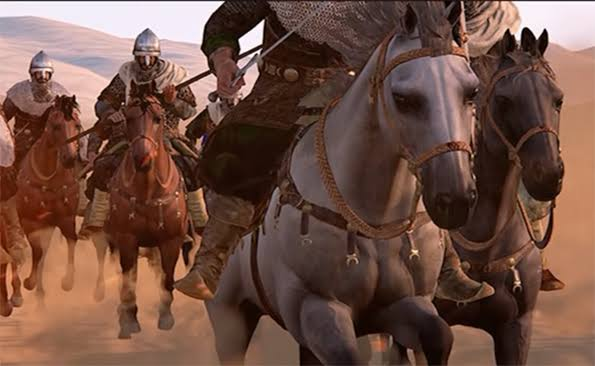

Malam itu, langit Makkah tampak gelap dan sunyi. Hanya suara angin
yang berhembus di antara rumah-rumah penduduk Quraisy. Seorang pemuda
gagah dengan sorot mata tajam duduk di halaman rumahnya, memandangi
langit dengan pikiran yang berkecamuk. Dia adalah Khalid bin Walid,
seorang prajurit Quraisy yang namanya sudah terkenal karena
keberaniannya di medan perang.

Di dalam hatinya, ia merasa bangga dengan kejayaan Quraisy, namun ada
sesuatu yang mengusik pikirannya. Islam, agama yang dibawa oleh
Muhammad, semakin hari semakin berkembang. Para sahabat yang dulu ia
anggap lemah, kini mulai menunjukkan kekuatan yang tidak bisa
diremehkan.

## Perang Uhud: Kemenangan yang Berubah Menjadi Penyesalan

Beberapa tahun sebelumnya, Khalid memimpin pasukan berkuda Quraisy
dalam **Perang Uhud**. Saat itu, ia melihat celah besar ketika pasukan
Muslim mulai lengah karena mereka terlalu cepat merayakan kemenangan.
Dengan strategi yang brilian, Khalid memimpin pasukannya mengitari
bukit dan menyerang kaum Muslim dari belakang.

Serangan mendadak itu membuat pasukan Muslim kacau balau. Banyak
sahabat Rasulullah gugur, termasuk Hamzah bin Abdul Muttalib, paman
Rasulullah yang dikenal sebagai Singa Allah.

Ketika pertempuran usai, Khalid berdiri di puncak bukit, melihat ke
arah Madinah dari kejauhan. Ia seharusnya merasa puas karena telah
memenangkan pertempuran, tetapi ada sesuatu yang mengganjal di
hatinya. Bagaimana bisa Muhammad dan pengikutnya yang awalnya lemah
tetap bertahan? Apa yang membuat mereka begitu yakin dengan ajaran
mereka?

## Perjalanan Menuju Islam

Waktu berlalu. Khalid mendengar tentang **Perjanjian Hudaibiyah**,
sebuah kesepakatan damai antara kaum Muslim dan Quraisy. Ia mulai
melihat perubahan yang terjadi di sekitarnya. Islam semakin diterima
oleh banyak orang, bahkan beberapa sahabatnya telah memeluk agama itu.

Saudaranya, Walid bin Walid, yang telah lebih dulu masuk Islam, sering
mengiriminya surat. Dalam salah satu suratnya, ia menulis: 

_"Wahai Khalid, engkau memiliki kecerdasan dan keberanian yang luar
biasa. Engkau pasti tahu bahwa Muhammad bukanlah pembohong. Sampai
kapan engkau akan menutup hatimu terhadap kebenaran?"_

Surat itu membuat Khalid termenung lama. Ia mulai merasa bahwa ada                                                    kebenaran dalam Islam yang selama ini ia abaikan.

Hingga suatu hari, ia memutuskan untuk meninggalkan Makkah. Diam-diam,
ia berangkat menuju Madinah bersama dua sahabatnya, Amr bin Ash dan
Utsman bin Talhah. Ketika mereka tiba di Madinah, mereka langsung
menuju Masjid Nabawi untuk bertemu dengan Rasulullah SAW.

Begitu melihat Khalid, Rasulullah tersenyum dan berkata, "Aku sudah
tahu bahwa engkau akan datang, wahai Abu Sulaiman (nama panggilan
Khalid). Allah telah memberikan petunjuk kepadamu."

Khalid merasa hatinya bergetar mendengar kata-kata itu. Ia pun berkata
dengan penuh penyesalan, "Wahai Rasulullah, aku telah banyak memerangi
Islam dan menyebabkan kesedihan bagi kaum Muslim. Maukah engkau
memaafkanku?"

Rasulullah meletakkan tangannya di bahu Khalid dan berkata dengan
penuh kasih sayang, "Islam menghapus segala dosa yang lalu, wahai
Khalid. Engkau sekarang adalah saudara kami."

Dengan penuh ketulusan, Khalid mengucapkan syahadat, "Aku bersaksi
bahwa tidak ada Tuhan selain Allah, dan Muhammad adalah utusan-Nya."

## Perang Mu'tah: Khalid Menjadi "Pedang Allah"

Setelah masuk Islam, Khalid tidak membuang waktu. Ia segera mengabdikan dirinya untuk perjuangan Islam.  

Pada tahun 629 M, Rasulullah mengirim pasukan Muslim ke wilayah Mu'tah
untuk menghadapi pasukan Romawi. Awalnya, tiga panglima utama Muslim
gugur dalam pertempuran ini, yaitu Zaid bin Haritsah, Ja'far bin Abi
Thalib, dan Abdullah bin Rawahah. Pasukan Muslim mulai kehilangan
arah, sementara pasukan Romawi yang jumlahnya ratusan ribu semakin
menekan mereka.

Di saat genting itu, seorang sahabat berteriak, "Khalid! Ambillah komando pasukan!"

Khalid segera maju dan mengambil alih kepemimpinan. Ia melihat keadaan
yang sangat tidak menguntungkan, tetapi otaknya bekerja cepat.

Di tengah pertempuran, ia mengatur strategi baru. Ia memerintahkan
pasukannya untuk berpindah posisi dan menyerang dengan formasi yang
berbeda agar musuh mengira bahwa bala bantuan Muslim telah datang.

Taktik itu ternyata membuahkan hasil! Pasukan Romawi menjadi ragu dan
kehilangan semangat. Di malam hari, Khalid memimpin pasukan Muslim
untuk mundur dengan teratur.

Ketika Rasulullah SAW mendengar tentang strategi cerdas ini, beliau
bersabda, "Khalid adalah pedang Allah yang terhunus." Sejak saat itu,
Khalid bin Walid dikenal dengan gelar **Saifullah** atau **Pedang
Allah**.

## Penaklukan Makkah: Kemenangan Tanpa Pertumpahan Darah

Setahun kemudian, pasukan Muslim bergerak menuju Makkah untuk
membebaskan kota itu dari kekuasaan Quraisy. Khalid diberi tugas
memimpin pasukan dari salah satu sisi kota. Ketika Makkah akhirnya
jatuh ke tangan kaum Muslim, Rasulullah SAW menunjukkan keteladanan
luar biasa dengan memberikan amnesti kepada penduduknya.

Namun, di beberapa sudut kota masih ada kelompok yang melawan. Khalid                                                 ditugaskan untuk mengatasi mereka. Dengan keahliannya, ia berhasil
menumpas perlawanan kecil tanpa memakan banyak korban.

Setelah penaklukan ini, Khalid semakin giat berjuang demi Islam. Ia
turut serta dalam **Perang Hunain**, di mana kaum Muslim menghadapi
suku Hawazin dan Tsaqif. Sekali lagi, kecerdikan dan keberaniannya
membawa kemenangan bagi Islam.

## Kesetiaannya Hingga Akhir Hayat Rasulullah SAW

Hingga Rasulullah SAW wafat pada tahun 632 M, Khalid bin Walid tetap
menjadi benteng pertahanan Islam. Ia tidak hanya berperang dengan
pedang, tetapi juga dengan kecerdasannya. Setelah Rasulullah wafat,
Khalid terus berjuang di bawah kepemimpinan Khalifah Abu Bakar dan
Umar bin Khattab, memperluas wilayah Islam ke berbagai penjuru dunia.

Namun, bagi Khalid, tidak ada yang lebih berarti selain perjuangannya
bersama Rasulullah. Ia sering mengenang bagaimana dahulu ia memusuhi
Islam, lalu Allah memberinya hidayah dan menjadikannya salah satu
pembela Islam yang paling setia.

Di penghujung hidupnya, meskipun telah memenangkan ratusan
pertempuran, Khalid bin Walid meninggal bukan di medan perang,
melainkan di atas tempat tidurnya. Dengan penuh penyesalan, ia
berkata, "Tidak ada satu pun bagian dari tubuhku kecuali penuh dengan
bekas luka perang. Namun, aku meninggal bukan di medan pertempuran."

 

_**Penulis:** Rangga Fajar Oktariansyah_
